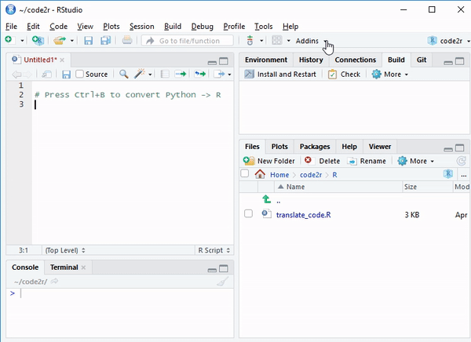

## imageclipr

RStudio Addin: Turn Python, Matlab, etc. commands into R commands.

By no means a complete code translator.

## Installation
`devtools::install_github('Timag/code2R')`

## Dependencies

RStudio (incl. rstudioapi)

## Open issues / feature requests

- enrichen small set of R, Python dictionary

- Add examples of Matlab Hiebeler dictionary

- reverse translation R to (Python, Matlab, etc.)

- Addin for Visual Studio Code, Spyder, etc.

- Integration of PR for new translation dict. entries

## Setup

### Adding a keyboard shortcut (Recommended)
In RStudio go to Tools - Modify Keyboard Shortcuts...

